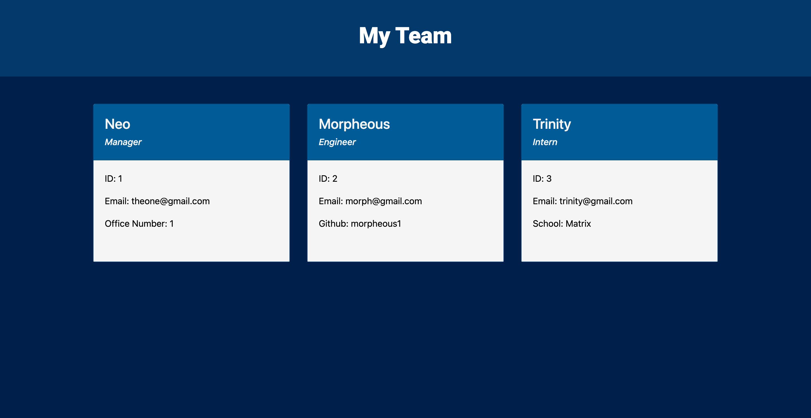

# TEAM PROFILE GENERATOR

  # License

  

  [MIT](https://opensource.org/licenses/MIT)

  # Description
  A command-line application that takes information about employees in a software engineering team and generates a HTML webpage that displays a short summary for each team member.

  This app was created primarily using node.js, inquirer, jest, as well as HTML and CSS.

  # User Story
  ```md
  AS A manager
  I WANT to generate a webpage that displays my team's basic info
  SO THAT I have quick access to their emails and GitHub profiles
  ``` 

  # Table of Contents:
  - [License](#license)
  - [Description](#description)
  - [User Story](#userstory)
  - [Installation](#installation)
  - [Usage](#usage)
  - [Contributing](#contributing)
  - [Tests](#tests)
  - [Questions](#questions)
  - [Credits](#credits)
  
  # Installation
  n/a

  # Usage
  This app was built so that a company can quickly access key summaries on specific teams at their business. 
  


  Below is a link to a video on how to use it:
  [https://watch.screencastify.com/v/fM3NOoNrviP4q3jJ5FOX]
  
  # Contributing
  n/a

  # Tests
  Jest was used to test each class file.

  # Questions
  If you have any queries or questions in relation to this application, please send to madeleine.codes@gmail.com.

  # Credits
  https://github.com/madeleinesc

